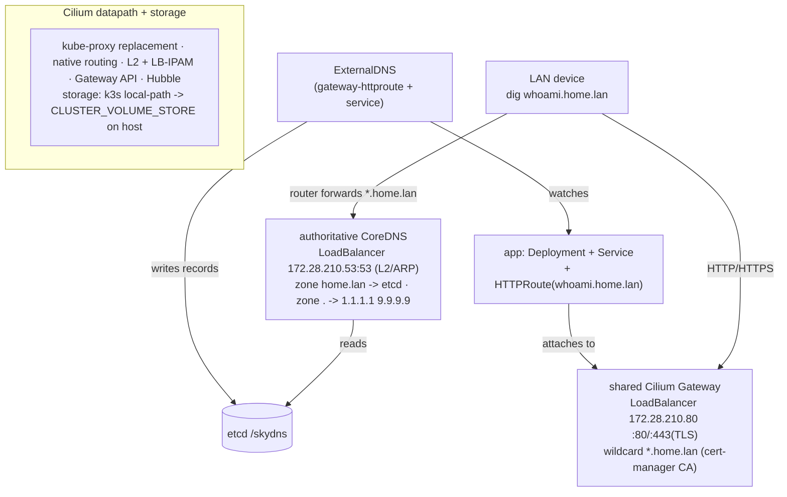

# k3d-lab — declarative home-lab k8s with zero-touch LAN DNS

📖 **Docs site:** <https://radheem.github.io/home-lab/> (architecture, runbooks, gallery)

A clean, declarative k3d setup. Deploy an app, attach an `HTTPRoute` with a
`*.home.lan` hostname, and it becomes reachable by name from any device on your
Wi-Fi — **no manual DNS edits**. DNS records are published automatically by
ExternalDNS into an authoritative CoreDNS that your LAN queries directly.

## Architecture



Two CoreDNS instances by design: the **cluster** CoreDNS (kube-dns, `cluster.local`)
and a separate **authoritative** CoreDNS for `home.lan` exposed to the LAN. The
cluster one forwards `home.lan` to the authoritative LB IP so pods resolve it too.

## Prerequisites

**Host CLIs** (tested versions for this environment):

| Tool | Tested | Notes |
|------|--------|-------|
| docker | 29.4.1 | container runtime for k3d |
| k3d | v5.8.3 | k3s-in-docker |
| kubectl | v1.31.0 | `kubectl kustomize` used (no standalone kustomize needed) |
| helm | v3.18.2 | charts: cilium, coredns, cert-manager |
| jq | 1.7 | |
| yq | **Python jq-wrapper** (kislyuk/yq) | components selector — **must be this yq, not mikefarah's** |
| envsubst | GNU gettext 0.21 | template rendering |
| dig | BIND 9.18 (`dnsutils`) | verification |
| tailscale | any | only for `--with-router` / Tailscale access |
| socat | any | only for the WSL→Windows runbook |

> **Which `yq`?** `components.sh` uses jq syntax, so it needs the **Python jq-wrapper
> `yq`** ([kislyuk/yq](https://github.com/kislyuk/yq)) — **not** mikefarah's Go `yq`.
> Install it (also needs `jq`). On Debian/Ubuntu the `yq` apt package *is* the
> jq-wrapper (and avoids the PEP 668 "externally-managed" pip error on 24.04):
> ```bash
> sudo apt-get install -y yq jq                     # Debian/Ubuntu
> # or via pipx:  sudo apt-get install -y pipx jq && pipx install yq && pipx ensurepath
> ```
> Verify: `yq --version` shows `yq <3.x>` and `yq --help` mentions *jq*. If instead it
> prints a `mikefarah` GitHub URL / `v4.x`, that one is winning on `PATH` (e.g.
> `/usr/local/bin/yq` or a snap) and the selector fails with
> `lexer: invalid input text "...cii_upcase..."` — remove/rename it (`which -a yq`) so
> the jq-wrapper resolves.

OS tested: **Ubuntu 24.04 LTS** (kernel 6.17). Rough sizing: 2 CPU / 4 GB for the
core platform; ~4 CPU / 8 GB if you enable the full component stack.

**Platform / component versions** (pinned — edit in `.env` or the component registry):

| Component | Version | Source |
|-----------|---------|--------|
| k3s | `v1.35.0-k3s3` | `.env` `K3S_VERSION` |
| Cilium | `1.19.0` | `.env` `CILIUM_VERSION` |
| Gateway API | `v1.2.1` | `.env` `GATEWAY_API_VERSION` |
| cert-manager | `v1.16.2` | `.env` `CERT_MANAGER_VERSION` |
| CoreDNS (cluster) chart | `1.39.2` | `.env` `COREDNS_CHART_VERSION` |
| ExternalDNS | `v0.15.1` | `manifests/20-external-dns` |
| etcd (auth-DNS store) | `v3.5.16` | `manifests/10-dns-system` |
| add-on components | node-exporter 4.43.0 · victoria-metrics-operator 0.59.2 · opentelemetry-operator 0.107.0 · grafana 10.5.15 · nats 2.12.4 · hatchet-stack 0.10.5 · cloudnative-pg 0.27.1 · ferretdb 2.7.0 | `components/registry/*/component.yaml` |

## Quickstart

```bash
cp .env.example .env        # edit IPs/TLD/storage to match your network
./install.sh                # one-click (--with-registry for an in-cluster image registry,
                            # --with-router for Tailscale, --verbose to debug)
```

Then point your LAN at the DNS (one of):
- **Router (recommended):** conditional-forward the zone `home.lan` → `172.28.210.53`.
- **Per device:** set `172.28.210.53` as the DNS server.

Verify:
```bash
export KUBECONFIG=$PWD/kubeconfig-homelab.yaml
dig @172.28.210.53 whoami.home.lan +short     # -> 172.28.210.80
curl -H 'Host: whoami.home.lan' http://172.28.210.80
```

## Add your own app (the whole contract)

Copy `manifests/50-examples/whoami.yaml`: a Deployment, a Service, and an
`HTTPRoute` whose `parentRefs` point at `shared-gateway` (ns `gateway-system`)
with a `*.home.lan` hostname. Nothing else — DNS + HTTPS are automatic.

## Layout

| Path | What |
|------|------|
| `.env.example` | All tunables (copy to `.env`, gitignored) |
| `install.sh` / `uninstall.sh` | One-click lifecycle |
| `lib/common.sh` | Logging, env load, render+apply helpers |
| `config/` | k3d config, Cilium + cluster-CoreDNS Helm values (templated) |
| `manifests/00..60` | Kustomize overlays applied in order (60 = optional image registry) |
| `tailscale/` | Optional subnet router + `approve-route.sh` (`--with-router`) |
| `docs/` | Runbooks, troubleshooting, cert-manager notes |
| `experiments/` | End-to-end validation runs (local, tailscale, remote approval) |

## Runbooks & experiments
- How it all fits together (diagrams): [docs/architecture.md](docs/architecture.md)
- Deploy + verify locally: [docs/runbooks/deploy-local.md](docs/runbooks/deploy-local.md)
- Deploy + verify over Tailscale: [docs/runbooks/tailscale-access.md](docs/runbooks/tailscale-access.md)
- WSL cluster + browse from Windows: [docs/runbooks/wsl-windows.md](docs/runbooks/wsl-windows.md)
- Add-on components (monitoring/messaging/workflow/db): [docs/runbooks/deploy-components.md](docs/runbooks/deploy-components.md) — selectable via [components/](components/)
- Add components to a running cluster (day-2): [docs/runbooks/add-components.md](docs/runbooks/add-components.md)
- In-cluster image registry (`--with-registry`): [docs/runbooks/registry.md](docs/runbooks/registry.md) — `docker push registry.home.lan/...`, nodes pull automatically
- Pull from a private external registry (Docker Hub): [docs/runbooks/private-registry.md](docs/runbooks/private-registry.md)
- Validation history & gotchas: [experiments/](experiments/) (01 local ✅, 02 tailscale ⏸, 03 remote approval 📐)

## TLS

`./install.sh` deploys cert-manager with an **internal CA** that issues a
`*.home.lan` wildcard for the Gateway. Trust it once per device:
```bash
kubectl -n cert-manager get secret home-lab-ca-tls \
  -o jsonpath='{.data.tls\.crt}' | base64 -d > home-lab-ca.crt
```
Public ACME DNS-01 is **not possible for an internal-only TLD** — see
[`docs/cert-manager.md`](docs/cert-manager.md).

See [`docs/troubleshooting.md`](docs/troubleshooting.md) when something misbehaves.
