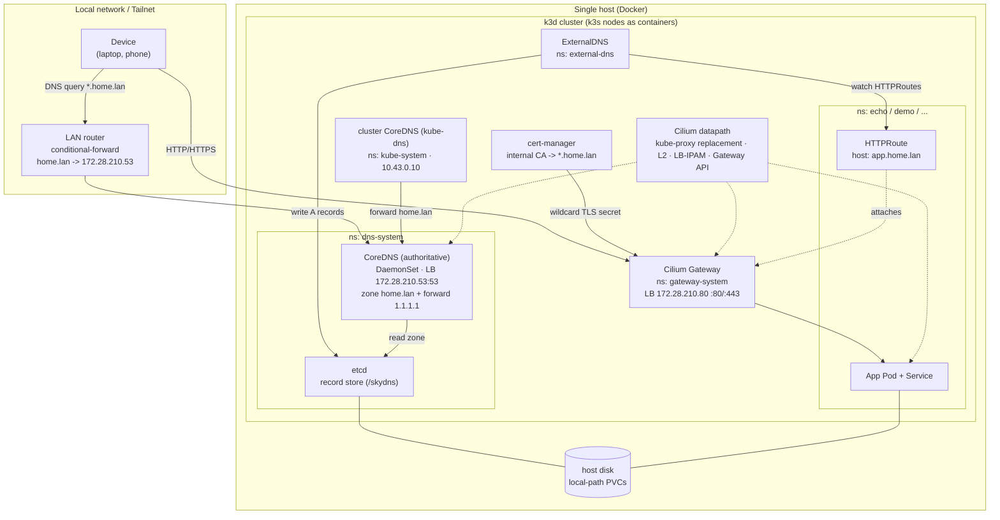
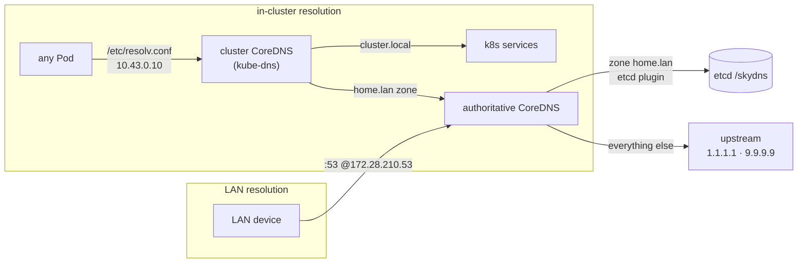
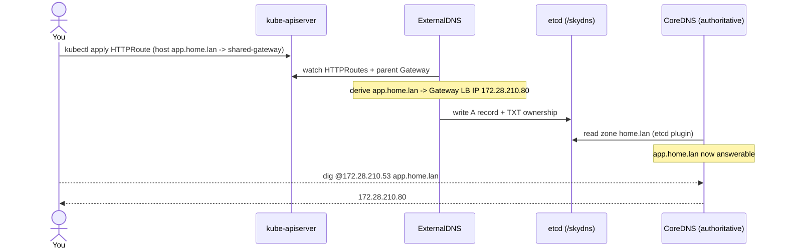
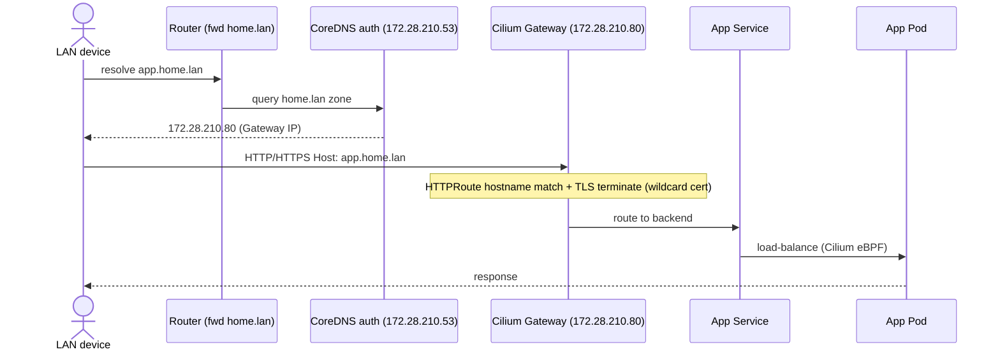
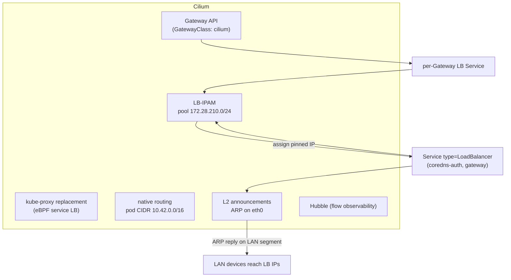
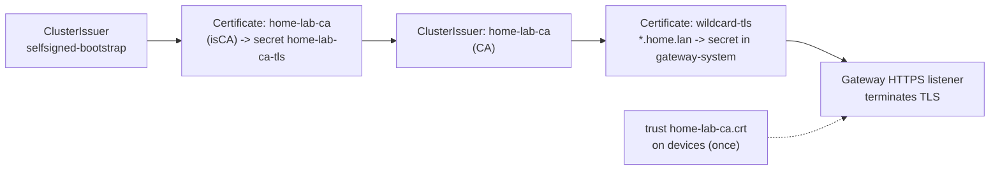
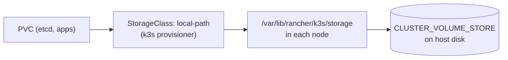
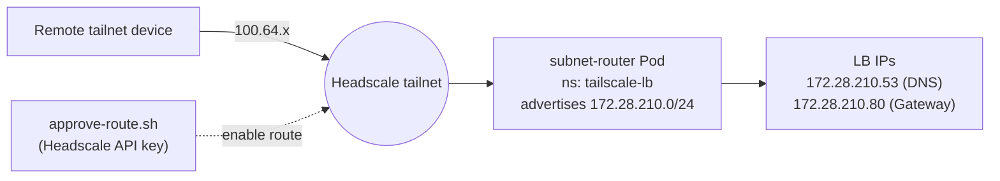

# Architecture

k3d-lab is a single-host Kubernetes home-lab (k3s-in-Docker via k3d) whose defining
feature is **zero-touch DNS**: deploy an app with an `HTTPRoute` carrying a
`*.home.lan` hostname and it becomes reachable by name from the LAN — no manual DNS,
no per-app config. This document explains how the pieces fit together.

> Values below use the `.env.example` defaults: TLD `home.lan`, LB pool
> `172.28.210.0/24`, authoritative DNS `172.28.210.53`, shared Gateway
> `172.28.210.80`, pod CIDR `10.42.0.0/16`, service CIDR `10.43.0.0/16`.

## 1. The big picture

## 2. Two DNS planes (and why)

There are **two** CoreDNS deployments with distinct jobs. Merging them onto one
host-exposed resolver is a footgun, so they stay separate.

- **Cluster CoreDNS (kube-dns)** — serves `cluster.local`; pods point at it
  (`10.43.0.10`). It also forwards the `home.lan` zone to the authoritative server so
  pods can resolve lab hostnames too.
- **Authoritative CoreDNS** — owns `home.lan`. Reads records from etcd (written by
  ExternalDNS) and forwards anything else to public upstreams. Exposed to the LAN on
  a pinned Cilium LoadBalancer IP `172.28.210.53` as a **DaemonSet** with
  `externalTrafficPolicy: Local` (so the node holding the L2 lease always has a local
  backend — see [experiment 01](../experiments/01-no-tailscale/) bug #5).

## 3. Zero-touch publish flow

What happens when you deploy an app and its `HTTPRoute`:

ExternalDNS uses `--source=gateway-httproute` and `--provider=coredns`, talking to
etcd at a pinned ClusterIP **by IP** (`10.43.0.20`) to avoid a gRPC-resolver issue
with k8s hostnames ([experiment 01](../experiments/01-no-tailscale/) bug #4).

## 4. End-to-end request path

## 5. Networking (Cilium)

Cilium replaces flannel, kube-proxy, and servicelb. k3s ships none of those (disabled
in `config/k3d-config.yaml`).

- **LB-IPAM** hands IPs from `172.28.210.0/24`; services pin theirs with
  `lbipam.cilium.io/ips`.
- **L2 announcements** answer ARP for those IPs on the node `eth0` segment, making
  them reachable on the LAN without an external load balancer.
- **Gateway API** is served natively by Cilium's Envoy — the shared Gateway is the
  single HTTP/HTTPS entrypoint (`172.28.210.80`).

## 6. TLS (cert-manager)

Local TLS for an internal TLD uses an internal CA (public ACME can't validate
`home.lan`). See [cert-manager.md](cert-manager.md).

## 7. Storage

The k3s local-path provisioner backs all PVCs; the node mount is bind-mounted to a
host directory (`CLUSTER_VOLUME_STORE`), so data persists on the device.

## 8. Remote access (optional, Tailscale)

A subnet router advertises the LB pool to a Headscale tailnet, so the same LB IPs are
reachable remotely. The advertised route must be approved (see
[runbook-tailscale.md](runbook-tailscale.md) and
[experiment 03](../experiments/03-remote-route-approval/)).

## 9. Component inventory

| Namespace | Component | Kind | Purpose |
|-----------|-----------|------|---------|
| `kube-system` | Cilium + operator | DaemonSet/Deploy | CNI, service LB, Gateway, L2, LB-IPAM |
| `kube-system` | CoreDNS (kube-dns) | Deployment | cluster DNS (`10.43.0.10`) + `home.lan` forward |
| `dns-system` | etcd | StatefulSet | DNS record store (`/skydns`), PVC on host |
| `dns-system` | CoreDNS (authoritative) | DaemonSet | serves `home.lan`, LB `172.28.210.53:53` |
| `external-dns` | ExternalDNS | Deployment | HTTPRoute -> etcd record automation |
| `gateway-system` | shared-gateway | Gateway | HTTP/HTTPS entrypoint, LB `172.28.210.80` |
| `cert-manager` | cert-manager | Deployments | internal CA, `*.home.lan` wildcard cert |
| `tailscale-lb` | subnet-router | Deployment | (optional) advertise LB pool to tailnet |
| `echo`/`demo` | echo / whoami | Deploy+Svc+HTTPRoute | example/test workloads |

## 10. Key design decisions

- **Two CoreDNS planes** keep cluster DNS and LAN-authoritative DNS isolated.
- **Pinned LB IPs** (DNS `.53`, Gateway `.80`) give stable, reboot-safe targets the
  router can forward to.
- **etcd addressed by IP** (`10.43.0.20`) sidesteps a gRPC hostname-resolution issue.
- **Authoritative CoreDNS as DaemonSet + `externalTrafficPolicy: Local`** so L2
  ingress always lands on a node with a local backend.
- **Internal CA for TLS** because public ACME can't issue for a local-only TLD.

All of these were validated (and several discovered) in the
[experiments](../experiments/).
