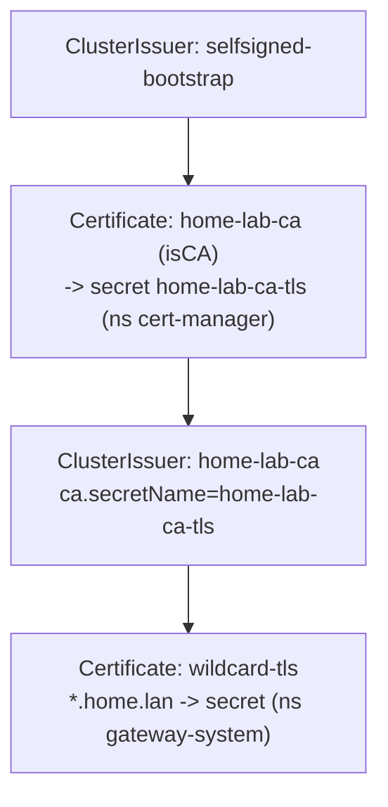

# cert-manager: local TLS now, public DNS-01 later

## What's installed now (works today)

`./install.sh` deploys cert-manager plus an **internal CA chain**:



The shared Gateway's HTTPS listener uses `wildcard-tls`, so every `*.home.lan`
host gets HTTPS automatically. Make it trusted on your devices:

```bash
kubectl -n cert-manager get secret home-lab-ca-tls \
  -o jsonpath='{.data.tls\.crt}' | base64 -d > home-lab-ca.crt
# Linux:  sudo cp home-lab-ca.crt /usr/local/share/ca-certificates/home-lab-ca.crt && sudo update-ca-certificates
# macOS:  sudo security add-trusted-cert -d -r trustRoot -k /Library/Keychains/System.keychain home-lab-ca.crt
# Firefox/Android: import the .crt manually.
```

Per-app certs are unnecessary (the Gateway wildcard covers everything). If you do
want one, add to the app's HTTPRoute namespace a `Certificate` with
`issuerRef: {name: home-lab-ca, kind: ClusterIssuer}`.

## Why not ACME DNS-01 for `home.lan`?

Two hard blockers:
1. **Public CAs can't validate an internal-only TLD.** Let's Encrypt will not issue
   for `home.lan` — it must be a domain you own in public DNS.
2. **cert-manager has no native CoreDNS/etcd DNS-01 solver.** Supported solvers are
   cloudflare, route53, azuredns, google, digitalocean, acmedns, **rfc2136**, and
   webhook. Our CoreDNS+etcd is none of these.

## The real upgrade paths (when you want public-trusted certs)

**Option A — public domain + provider DNS-01 (simplest).** Own e.g.
`lab.example.com`, point apps at `*.lab.example.com`, and use the template
`manifests/40-cert-manager/dns01-clusterissuer.yaml.disabled` (Cloudflare example):
```bash
kubectl -n cert-manager create secret generic cloudflare-api-token \
  --from-literal=api-token=<scoped-token>
kubectl apply -f manifests/40-cert-manager/dns01-clusterissuer.yaml.disabled
```
Use split-horizon DNS so `lab.example.com` resolves to your Gateway IP internally.

**Option B — local ACME CA (step-ca) with RFC2136.** Run smallstep `step-ca` as an
ACME server and a small RFC2136-capable DNS (e.g. BIND/CoreDNS-with-tsig) for the
challenge, then use cert-manager's `rfc2136` solver. Heavier; keeps everything local.

Until then, the internal CA above is the correct, zero-cost local-TLS answer.
