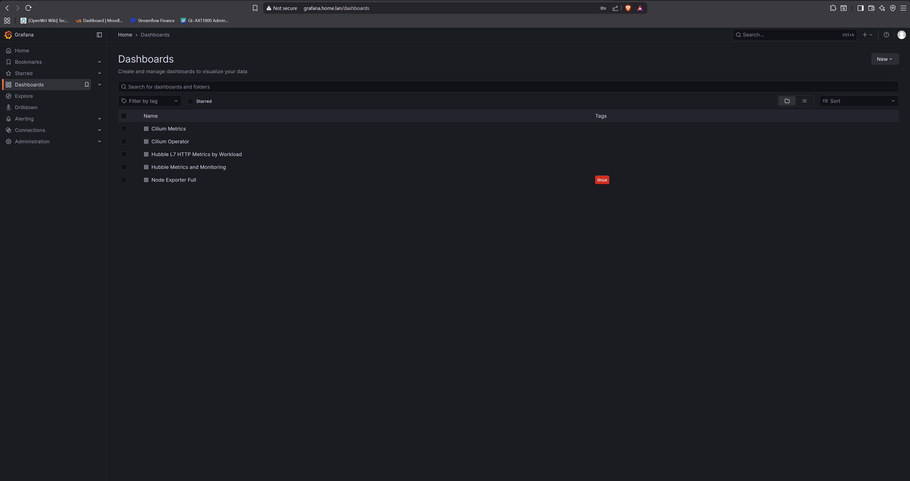
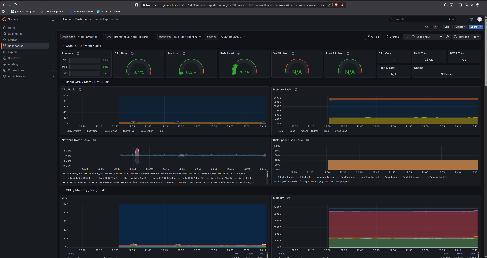
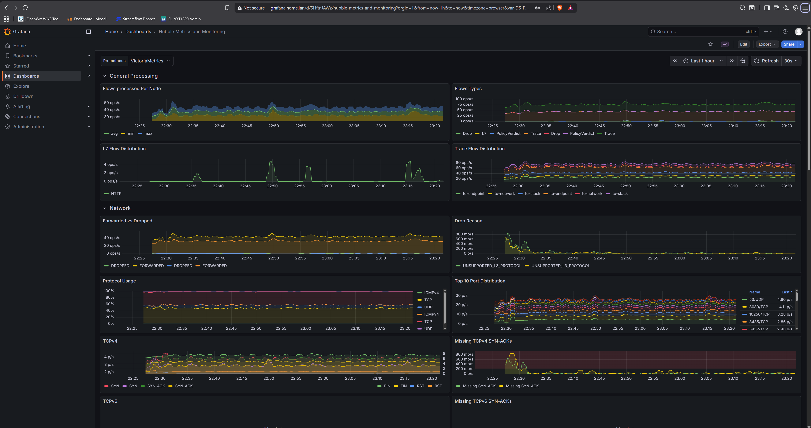
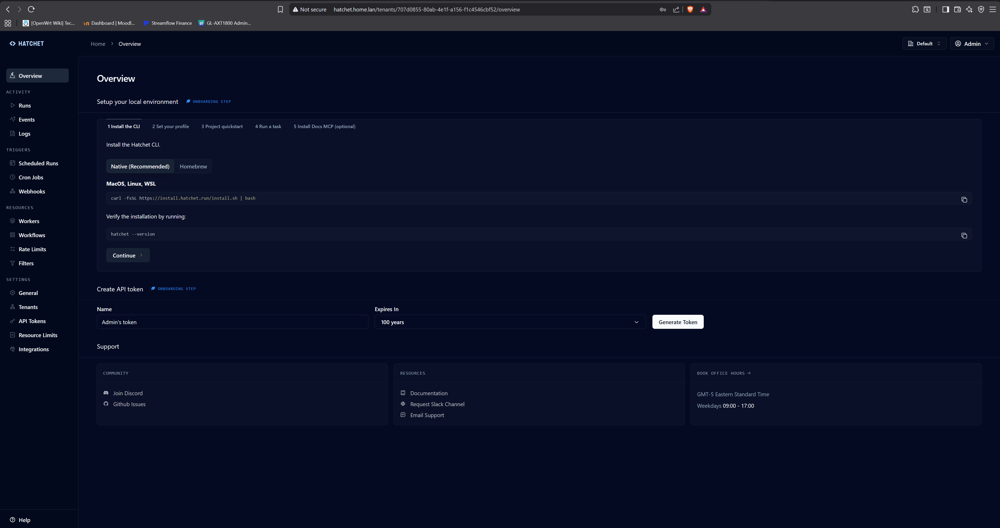

# Gallery

Screenshots from a live `k3d-lab` cluster — the platform plus the full component stack,
every service reachable on its `*.home.lan` name with a certificate from the internal CA.

## The running cluster

<figure markdown>
  { loading=lazy }
  <figcaption>One k3d cluster: cert-manager, Cilium, the DNS system (etcd + authoritative
  CoreDNS), ExternalDNS, and the full add-on stack (VictoriaMetrics, Grafana, OpenTelemetry,
  NATS, Hatchet, CloudNativePG, FerretDB) all running.</figcaption>
</figure>

## Monitoring — Grafana on `grafana.home.lan`

Dashboards are provisioned automatically from prebuilt JSON via the Grafana sidecar; the
datasource is VictoriaMetrics, fed by VMAgent scrapes of Cilium, Hubble, and node-exporter.

<figure markdown>
  { loading=lazy }
  <figcaption>Bundled dashboards: Cilium Metrics, Cilium Operator, Hubble L7 HTTP,
  Hubble Metrics &amp; Monitoring, and Node Exporter Full.</figcaption>
</figure>

<figure markdown>
  { loading=lazy }
  <figcaption>Node Exporter Full — CPU / memory / disk / network for the cluster host.</figcaption>
</figure>

<figure markdown>
  { loading=lazy }
  <figcaption>Hubble flow telemetry — flows processed, verdicts, L7 HTTP, drop reasons —
  sourced from Cilium's eBPF datapath.</figcaption>
</figure>

## Workflow — Hatchet on `hatchet.home.lan`

<figure markdown>
  { loading=lazy }
  <figcaption>The Hatchet workflow manager UI, exposed via an HTTPRoute on the shared
  Cilium Gateway and resolved through the zero-touch DNS pipeline.</figcaption>
</figure>

---

Want to reproduce these? Start with [Deploy locally](runbooks/deploy-local.md), then
[Deploy components](runbooks/deploy-components.md).
