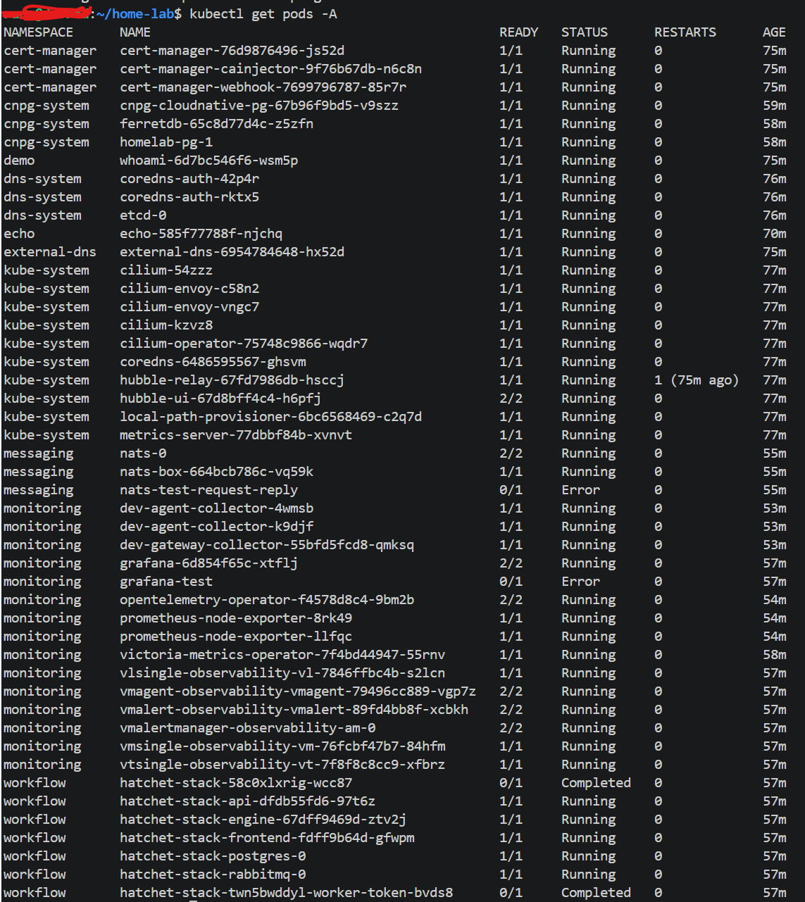
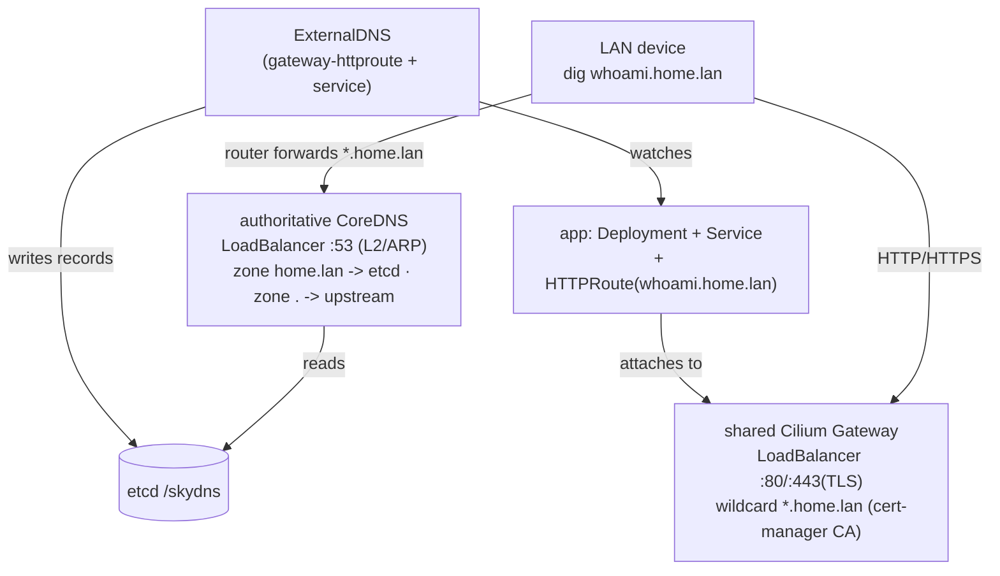

# k3d-lab

**Declarative home-lab Kubernetes with zero-touch LAN DNS.**

Deploy an app, attach an `HTTPRoute` with a `*.home.lan` hostname, and it becomes
reachable by name from any device on your network — **no manual DNS edits**. Records
are published automatically by ExternalDNS into an authoritative CoreDNS that your LAN
queries directly, and HTTPS is issued by an internal cert-manager CA.

[Deploy it locally](runbooks/deploy-local.md){ .md-button .md-button--primary }
[See the architecture](architecture.md){ .md-button }
[Browse the gallery](gallery.md){ .md-button }

---

## The result

A single `./install.sh` brings up the platform; `./components.sh deploy` adds the
selected monitoring / messaging / workflow / database stack. Everything lands with a
`*.home.lan` name and a trusted certificate:

<figure markdown>
  { loading=lazy }
  <figcaption>The platform + full component stack running in one k3d cluster (<code>kubectl get pods -A</code>).</figcaption>
</figure>

## How it fits together

Full diagrams and the design rationale are in [Architecture](architecture.md).

## Get started

| I want to… | Go to |
|------------|-------|
| Stand up the cluster on this machine | [Deploy locally](runbooks/deploy-local.md) |
| Add the monitoring / messaging / DB stack | [Deploy components](runbooks/deploy-components.md) |
| Add a component to a running cluster | [Add components (day-2)](runbooks/add-components.md) |
| Reach `*.home.lan` over Tailscale | [Tailscale access](runbooks/tailscale-access.md) |
| Run in WSL and browse from Windows | [WSL → Windows](runbooks/wsl-windows.md) |
| Understand TLS / the internal CA | [TLS / cert-manager](cert-manager.md) |
| Fix something | [Troubleshooting](troubleshooting.md) |

!!! note "Prerequisites & versions"
    The tested CLI/component version matrix lives in the
    [repository README](https://github.com/radheem/home-lab/blob/main/README.md#prerequisites).
    Note the `yq` requirement (Python jq-wrapper, **not** mikefarah's Go `yq`) for the
    component selector.

The source, install scripts, and component registry are on
[GitHub](https://github.com/radheem/home-lab).
